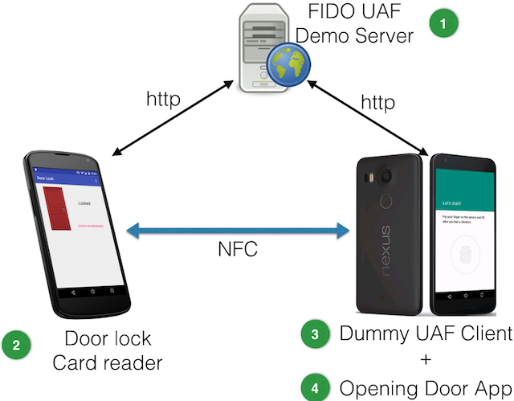
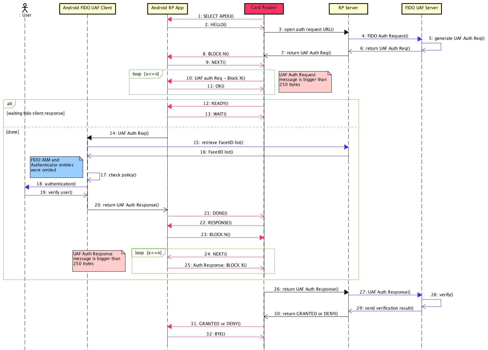

[](https://travis-ci.org/emersonmello/DoorlockCardReader)

# Door lock NFC card reader for Android mobile phone

## Motivation

Is it possible to use [FIDO UAF Standard](https://fidoalliance.org/specifications/download/) on an Android mobile + NFC to openning doors?

This project is a simple prototype to verify how FIDO could be used in this scenario (see [FIDO Security Reference](https://fidoalliance.org/specs/fido-uaf-v1.0-ps-20141208/fido-security-ref-v1.0-ps-20141208.html#threats-to-the-secure-channel-between-client-and-relying-party)). This [card reader](https://github.com/emersonmello/DoorlockCardReader) uses NFC to communicate with a specific [Android Openning Door App](https://github.com/emersonmello/openingdoor), that emulates a NFC card using Android's [Host-based Card Emulation](https://developer.android.com/guide/topics/connectivity/nfc/hce.html) functionality. 

The [card reader](https://github.com/emersonmello/DoorlockCardReader) and [Android Openning Door App](https://github.com/emersonmello/openingdoor) depend of a third-party, called [FIDO UAF RP Server](https://github.com/emersonmello/UAF).

Figure below shows all necessary components and the relation between them



## Requirements

1. One Android mobile phone (with NFC) to acts like a card reader (Android OS >= 5)
1. One Android mobile phone (with NFC) to acts like a card (Android OS >= 6 + Fingerprint sensor)
1. One computer to host FIDO UAF Demo Server

## Getting necessary codes 

1. [FIDO UAF Demo Server](https://github.com/emersonmello/UAF)
  - If you prefer, there is a [Docker container](https://www.docker.com/what-docker) ready to use here: https://github.com/emersonmello/docker-fidouafserver
1. [Door lock NFC card reader for Android](https://github.com/emersonmello/DoorlockCardReader) - You are already here!
1. [Dummy FIDO UAF Client](https://github.com/emersonmello/dummyuafclient)
1. [Opening Door Android App](https://github.com/emersonmello/openingdoor)


## Setting up

1. Start **FIDO UAF Demo Server**
1. Install [Door lock NFC card reader for Android](https://github.com/emersonmello/DoorlockCardReader)
1. On **Door lock card reder for Android** touch on "Settings" on the main application menu and update "server endpoint" field to the **IP Address** and **PORT** where you are running the **FIDO UAF Demo Server**
1. Install **Dummy FIDO UAF Client** and **Opening Door Android App** on your another Android phone
1. On **Opening Door Android App** touch on "Settings" on the main application menu and update "server endpoint" field to the **IP Address** and **PORT** where you are running the **FIDO UAF Demo Server**  
1. On **Opening Door Android App** touch on "See app facetID" on the main application menu and insert the showed value in FIDO UAF Demo Server MySQL database:
  - For instance: ```INSERT  INTO facets (fDesc) values ('android:apk-key-hash:Lir5oIjf552K/XN4bTul0VS3GfM')```

## Testing 

1. Open **Opening Door Android App** and touch "Register" button
1. Open **Door lock card reader for Android**
1. Tap your another Android mobile phone (card) on "Android card reader"
1. Follow the instructions provided by application (i.e. put your finger on the sensor, etc.) and you should see the message "Access Granted"

## UML Sequence Diagram 




